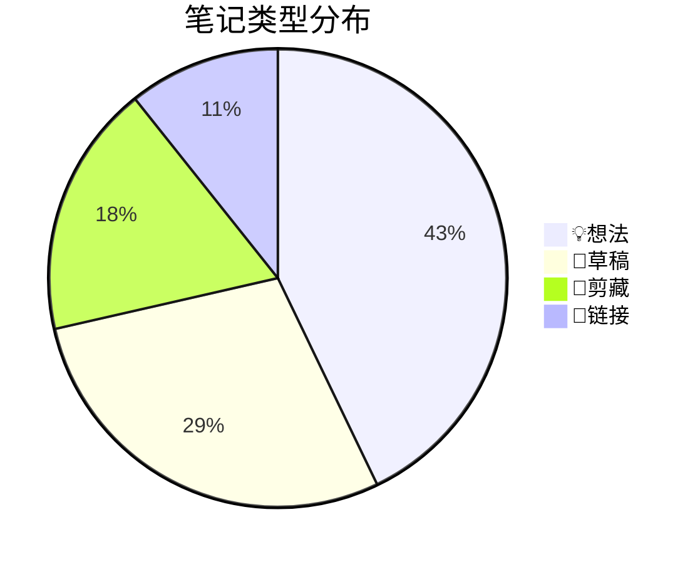

# Note Triage Skill (笔记分诊)

快速分析 `+` 文件夹中的临时笔记，生成结构化的分类建议报告。

## 🎯 核心功能

1. **内容扫描**：批量读取 `+` 文件夹中的笔记
2. **智能分类**：判断每条笔记的类型和归属
3. **可视化报告**：生成 Mermaid 图表展示分析结果
4. **行动建议**：给出具体的处理方案

---

## 📊 分析维度

对每条笔记进行以下评估：

| 维度         | 说明           | 评级标准                                                   |
| ------------ | -------------- | ---------------------------------------------------------- |
| **类型**     | 笔记的本质     | 💡想法、📝草稿、📎剪藏、✅待办、❓问题、🔗链接                   |
| **完整度**   | 内容的完善程度 | 🟢高(可直接归档) / 🟡中(需补充) / 🔴低(片段)                  |
| **关键词**   | 核心主题标签   | 1-3个关键词                                                |
| **价值**     | 是否值得保留   | ⭐⭐⭐高 / ⭐⭐中 / ⭐低 / ❌可删除                               |
| **建议去向** | 应该归档到哪里 | 21-Creation / 23-BibCard / 24-MainCard / 10-Action / 🗑️删除 |

---

## 🔧 执行流程

### Step 1: 扫描笔记库结构

首先，快速获取笔记库的"地图"（不读取内容，只看结构）：

```
需要执行的命令：
1. 列出 20-Card 的子文件夹结构
2. 列出 10-Action 中正在进行的项目
3. 获取常用标签列表（通过 grep 搜索 tags: 字段）
```

**目的**：建立上下文，无需读取所有笔记内容，节省 token。

### Step 2: 批量分析 + 文件夹

读取 `+` 文件夹中的所有笔记，对每条笔记进行评估。

**分析策略**：
- 根据文件大小判断完整度（<100字节=片段，>1000字节=详细）
- 根据标题和前 200 字判断类型
- 根据是否有 `tags:` 或 `[[]]` 判断是否已初步整理

### Step 3: 生成分诊报告

输出格式为 Markdown，包含：

#### 3.1 总览图表（Mermaid Sankey/Pie）



#### 3.2 详细分析表格

> **格式规则**：文件名使用 Obsidian 双链格式 `[[文件名]]`，方便直接点击跳转。

| 文件名                    | 类型  | 完整度 | 关键词       | 价值 | 建议去向      |
| ------------------------- | ----- | ------ | ------------ | ---- | ------------- |
| [[1 个月写了 300 张卡片]] | 📝草稿 | 🟢高    | 卡片盒, 写作 | ⭐⭐⭐  | → 21-Creation |
| [[未命名1]]               | 🔗链接 | 🔴低    | 工具         | ⭐    | 提取后删除    |

> ⚠️ **注意**：报告中不生成待办任务清单，只提供分类建议。用户自行决定处理优先级。

---

## 🧠 智能关联（可选，低 token 消耗）

通过以下方式实现与库的上下文关联，**无需读取所有笔记**：

### 方法 1: 标签索引

```bash
# 快速获取库中所有标签
grep -rh "^tags:" ./20-Card ./10-Action | sort | uniq -c | sort -rn | head -20
```

这样可以知道：
- 库中最常用的标签是什么
- 新笔记应该用什么标签

### 方法 2: 链接图谱采样

```bash
# 获取最活跃的笔记（被引用最多）
grep -roh "\[\[.*\]\]" ./20-Card | sort | uniq -c | sort -rn | head -20
```

这样可以知道：
- 哪些笔记是"枢纽笔记"
- 新笔记可以链接到哪里

### 方法 3: MOC 索引

读取 `22-IndexCard` 中的索引卡，这些卡片本身就是库的结构地图。

---

## 🎮 使用方式

### 快速模式

```
/笔记-笔记分诊
```
只分析 + 文件夹，生成报告。

### 完整模式

```
/笔记-笔记分诊 --with-context
```
先扫描库结构，再分析笔记，给出更精准的归档建议。

### 指定数量

```
/笔记-笔记分诊 --limit 10
```
只分析前 10 条笔记（按修改时间排序）。

---

## 📋 输出模板

最终报告保存位置：`+/[日期]-分诊报告.md`

报告结构：
```markdown
---
created: {{date}}
type: triage-report
---

# 📋 笔记分诊报告 - {{date}}

## 📊 总览
- 扫描笔记数：{{total}}
- 高价值笔记：{{high_value}}
- 建议删除：{{to_delete}}

## 📈 类型分布
{{mermaid_pie_chart}}

## 📝 详细列表
{{analysis_table}}

## 📊 库上下文关联建议
{{context_suggestions}}
```

---

## ⚡ Token 优化策略

为什么这个 skill 不会消耗太多 token：

1. **只读取 + 文件夹**：临时笔记通常较短
2. **元数据优先**：用文件名、大小、frontmatter 做初步判断
3. **增量分析**：每次只处理未分析的笔记
4. **结构化输出**：用表格和图表替代长文描述

---

## 🔄 后续扩展

可以与其他 skill 联动：
- `创作-选题规划`：将高价值想法转化为选题
- `创作-草稿打磨`：润色需要发布的草稿
- `创作-创意生成器`：基于现有笔记生成新想法
