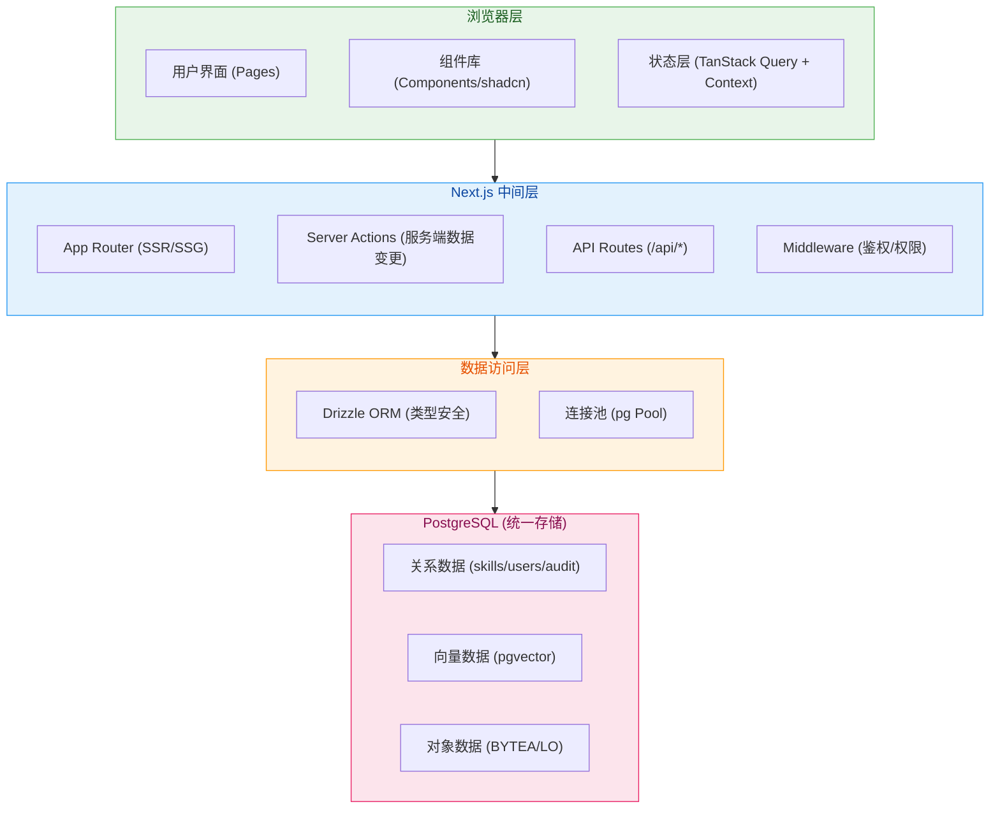
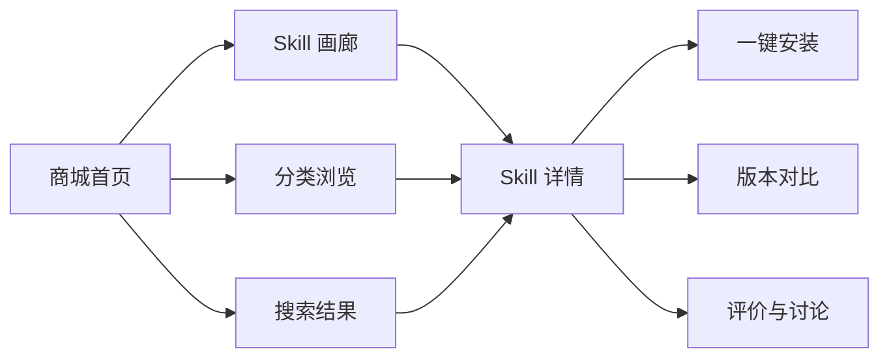
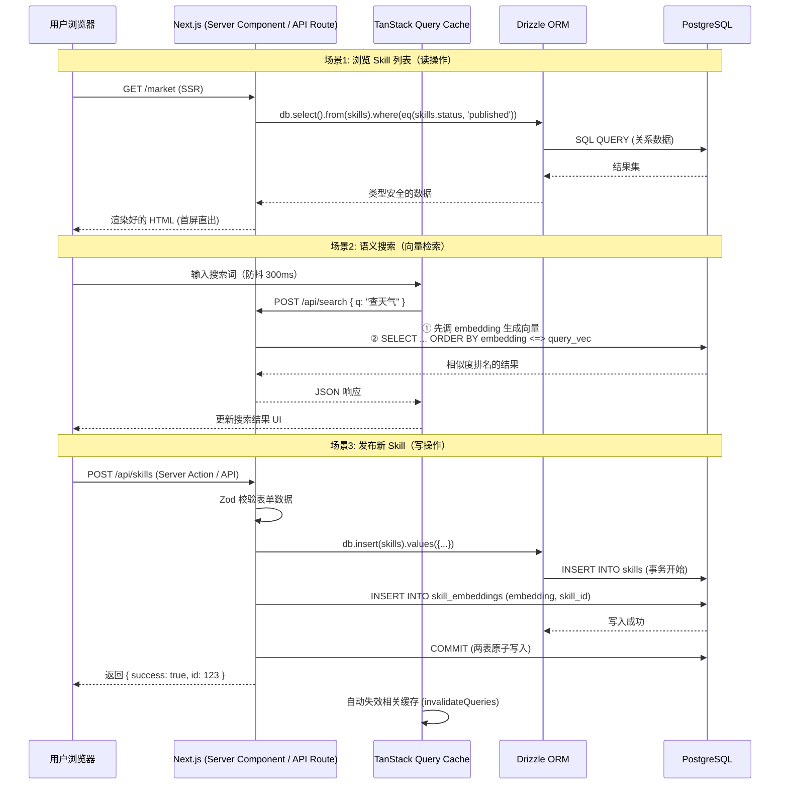
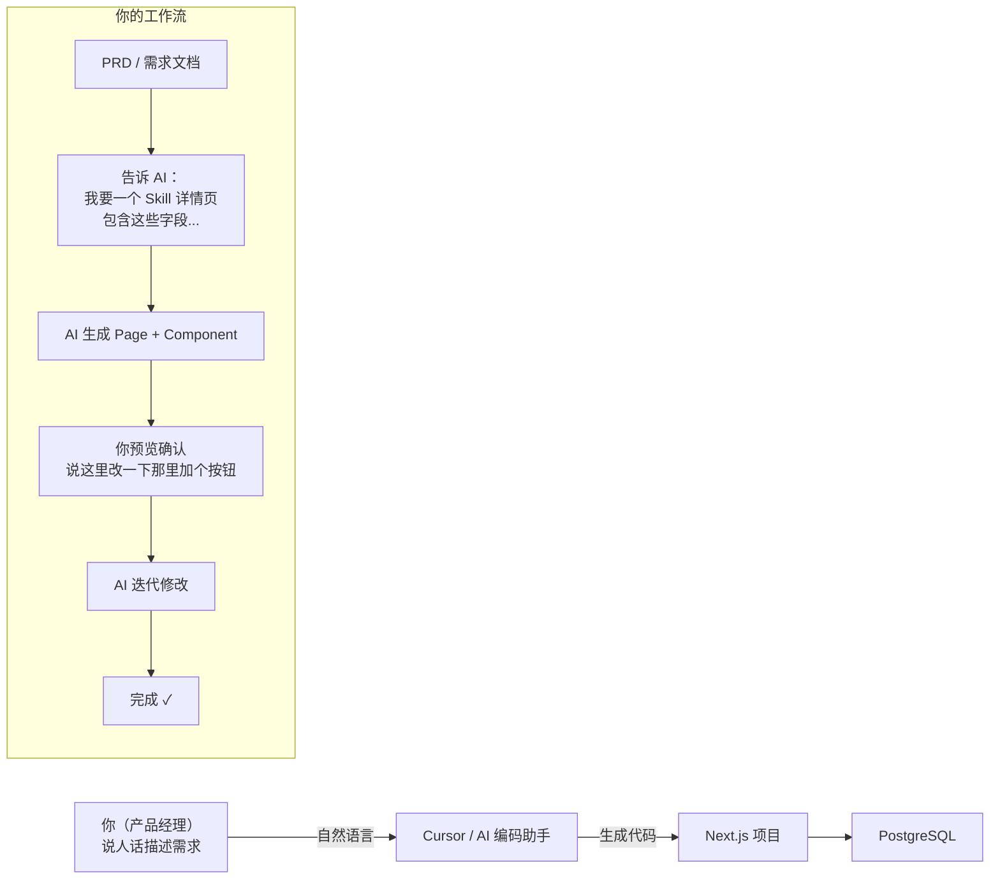

---
project:
  - AI数字员工项目
index:
tags:
  - AI产品
created: "{{2026-06-17}}"
up:
relate:
  - "[[2603-AI数字员工项目]]"
---
通过PG来作为技术选项，帮我设计一个套前端的架构


### **推荐 Next.js 14 + shadcn/ui + Tailwind CSS 全栈方案，一套框架覆盖管理后台 + 商城前台 + 开发者门户，完美匹配你的 Vibe Coding 工作流。**

  

---

  

## 一、技术选型决策（为什么是这套组合）

  

| 层面 | 选型 | 理由 |

|------|------|------|

| **核心框架** | Next.js 14 (App Router) | 文件即路由、SSR/SSG 混合渲染、API Routes 内置，一个项目同时做前台+后台+API |

| **UI 组件库** | shadcn/ui + Radix UI | 组件源码复制进项目，可任意改，不像 Ant Design 被"锁死"；无障碍原生支持；Vibe Coding 友好度最高 |

| **样式方案** | Tailwind CSS 4 | 原子化 CSS，AI 生成样式代码直接能用，不用切来切去写 SCSS 文件 |

| **语言** | TypeScript | 类型安全，配合 PG 的 schema 可以自动生成前端类型 |

| **状态管理** | TanStack Query (React Query) | 服务端状态（从 PG 拉的数据）用它，客户端状态用 useState/useState 足够，MVP 不需要 Redux |

| **表单处理** | React Hook Form + Zod | Zod schema 可前后端共享校验规则，和 PG 的约束联动 |

| **图表** | Recharts / Tremor | 后台数据统计面板用，轻量且好看 |

| **ORM/数据库** | Drizzle ORM | 类型安全的 PG 操作，比 Prisma 更轻量，Vibe Coding 时 AI 更容易生成正确代码 |

| **部署** | Vercel / Docker | Vercel 零配置部署；Docker 打包后端 PG + 前端一起走 |

  

> **为什么不选 Vue？** 你的场景是 AI Agent 生态，React 生态在 AI/LLM 工具链中占绝对主导（LangChain、Vercel AI SDK、shadcn 都是 React 优先）。作为产品经理做 Vibe Coding，选生态最丰富的路线能大幅降低 AI 辅助编码的摩擦成本。[CSDN](https://blog.csdn.net/csdn122345/article/details/161235201)

  
---

  

## 二、整体架构分层

  



  

---

  

## 三、项目目录结构

  

```

skill-marketplace/

├── public/

│   ├── logo.svg

│   └── favicon.ico

├── src/

│   ├── app/                          # App Router（页面 = 路由）

│   │   ├── layout.tsx                # 根布局（导航栏 + 侧边栏）

│   │   ├── page.tsx                  # 首页 / 商城大厅

│   │   ├── globals.css               # 全局样式 (Tailwind)

│   │   │

│   │   ├── (market)/                 # 商城前台路由组

│   │   │   ├── layout.tsx            # 商城布局（搜索栏 + 分类导航）

│   │   │   ├── page.tsx              # Skill 列表/画廊

│   │   │   ├── skill/

│   │   │   │   └── [id]/

│   │   │   │       └── page.tsx      # Skill 详情页

│   │   │   ├── search/

│   │   │   │   └── page.tsx          # 搜索结果页（关键词 + 语义混合）

│   │   │   └── categories/

│   │   │       └── [slug]/

│   │   │           └── page.tsx      # 分类浏览页

│   │   │

│   │   ├── (dashboard)/              # 管理后台路由组

│   │   │   ├── layout.tsx            # 后台布局（侧边栏菜单）

│   │   │   ├── page.tsx              # 仪表盘（概览统计）

│   │   │   ├── my-skills/

│   │   │   │   ├── page.tsx          # 我的 Skill 列表

│   │   │   │   └── new/

│   │   │   │       └── page.tsx      # 发布新 Skill（表单页）

│   │   │   ├── review/

│   │   │   │   └── page.tsx          # 审核队列（审核员视角）

│   │   │   ├── analytics/

│   │   │   │   └── page.tsx          # 使用统计面板

│   │   │   └── settings/

│   │   │       └── page.tsx          # 团队/命名空间设置

│   │   │

│   │   ├── (dev)/                    # 开发者门户路由组

│   │   │   ├── layout.tsx

│   │   │   ├── page.tsx              # 开发者文档首页

│   │   │   ├── docs/

│   │   │   │   └── [...slug]/

│   │   │   │       └── page.tsx      # 动态文档页

│   │   │   └── console/

│   │   │       └── page.tsx          # 在线 Skill 测试控制台

│   │   │

│   │   ├── api/                      # API Routes（后端接口）

│   │   │   ├── skills/

│   │   │   │   ├── route.ts          # GET 列表 / POST 创建

│   │   │   │   └── [id]/

│   │   │   │       └── route.ts      # GET 详情 / PUT 更新 / DELETE

│   │   │   ├── search/

│   │   │   │   └── route.ts          # POST 语义搜索（调 pgvector）

│   │   │   ├── upload/

│   │   │   │   └── route.ts          # POST 文件上传（存 PG BYTEA/LO）

│   │   │   ├── audit/

│   │   │   │   └── route.ts          # PUT 审核操作

│   │   │   └── auth/

│   │   │       └── route.ts          # 登录/鉴权

│   │   │

│   │   └── auth/                     # 认证页面

│   │       ├── login/page.tsx

│   │       └── register/page.tsx

│   │

│   ├── components/                   # 组件库（按领域分目录）

│   │   ├── ui/                       # shadcn/ui 基础组件（自动生成）

│   │   │   ├── button.tsx

│   │   │   ├── card.tsx

│   │   │   ├── dialog.tsx

│   │   │   ├── input.tsx

│   │   │   ├── table.tsx

│   │   │   ├── badge.tsx

│   │   │   ├── tabs.tsx

│   │   │   └── ... (按需添加)

│   │   │

│   │   ├── skill/                    # Skill 业务组件

│   │   │   ├── skill-card.tsx        # Skill 卡片（列表/网格展示）

│   │   │   ├── skill-detail.tsx      # Skill 详情主体

│   │   │   ├── skill-form.tsx        # 发布/编辑表单

│   │   │   ├── skill-manifest-editor.tsx  # Manifest 编辑器（Markdown）

│   │   │   ├── skill-install-btn.tsx      # 安装按钮 + 状态

│   │   │   └── version-selector.tsx       # 版本选择器

│   │   │

│   │   ├── search/                   # 搜索相关

│   │   │   ├── search-bar.tsx        # 顶部搜索栏

│   │   │   ├── filter-panel.tsx      # 左侧筛选面板

│   │   │   └── search-results.tsx    # 搜索结果列表

│   │   │

│   │   ├── layout/                   # 布局组件

│   │   │   ├── sidebar.tsx           # 后台侧边栏

│   │   │   ├── top-nav.tsx           # 顶部导航

│   │   │   ├── breadcrumb.tsx        # 面包屑

│   │   │   └── shell.tsx             # 整体外壳（Nav + Sidebar + Content）

│   │   │

│   │   └── shared/                   # 通用业务组件

│   │       ├── data-table.tsx        # 通用数据表格（排序/分页/筛选）

│   │       ├── empty-state.tsx       # 空状态占位

│   │       ├── loading-skeleton.tsx  # 加载骨架屏

│   │       ├── confirm-dialog.tsx    # 二次确认弹窗

│   │       └── markdown-renderer.tsx # Markdown 渲染（Skill 描述用）

│   │

│   ├── lib/                          # 工具函数 & 配置

│   │   ├── utils.ts                  # cn() 等通用工具（shadcn 自带）

│   │   ├── pg-client.ts              # PostgreSQL 连接池单例

│   │   ├── embeddings.ts             # Embedding 生成（调 LLM API）

│   │   └── validators.ts             # Zod 共享校验 schema

│   │

│   ├── db/                           # 数据库层

│   │   ├── schema.ts                 # Drizzle ORM 表定义（映射 PG 表）

│   │   ├── index.ts                  # 数据库连接导出

│   │   └── migrations/               # 数据库迁移文件

│   │       └── 0001_initial.sql

│   │

│   ├── hooks/                        # 自定义 Hooks

│   │   ├── use-skills.ts             # Skill CRUD 操作封装

│   │   ├── use-search.ts             # 搜索逻辑（防抖 + 分页）

│   │   ├── use-debounce.ts           # 防抖 Hook

│   │   └── use-auth.ts               # 认证状态

│   │

│   ├── store/                        # 客户端状态（仅少量全局状态）

│   │   └── auth-context.tsx          # 用户认证上下文

│   │

│   └── types/                        # TypeScript 类型定义

│       ├── skill.ts                  # Skill 相关类型

│       ├── api.ts                    # API 请求/响应类型

│       └── pg.ts                     # 从 Drizzle schema 自动推导

│

├── drizzle.config.ts                 # Drizzle ORM 配置

├── tailwind.config.ts                # Tailwind 配置

├── tsconfig.json

├── next.config.ts

├── package.json

└── .env.local                        # PG 连接串等环境变量

```

  

---

  

## 四、核心页面设计（三大入口）

  

### **4.1 商城前台 -- Skill 发现与安装**

  

这是面向所有用户的主入口，类似 npmjs.com 或 VS Code 插件市场。

  



  

**首页关键区域：**

  

| 区域 | 组件 | 对应 PG 数据 |

|------|------|-------------|

| 顶部搜索栏 | `search-bar.tsx` | 输入 → `/api/search` → pgvector 语义检索 + 关键词 LIKE 混合 |

| 分类标签云 | `category-tabs.tsx` | `SELECT category, COUNT(*) FROM skills GROUP BY category` |

| 推荐 Skill 轮播 | `featured-carousel.tsx` | `WHERE status='published' ORDER BY download_count DESC LIMIT 10` |

| 最新发布列表 | `skill-card.tsx` (网格) | `ORDER BY created_at DESC LIMIT 20` |

| 热门下载榜 | `ranking-list.tsx` | `ORDER BY download_count DESC LIMIT 20` |

  

**Skill 详情页核心信息：**

  

- 基本信息：名称、版本、作者、分类、许可证（来自 `skills` 表）

- Manifest 内容：Markdown 渲染的 Skill 说明（来自 `prompt_text` / `manifest_json`）

- 参数 Schema：自动生成参数说明表格（来自 `schema_json`）

- 安装命令：根据不同 Agent 平台生成安装指令

- 版本历史：时间线展示（来自 `versions` 表或自关联）

  

### **4.2 管理后台 -- 发布 / 审核 / 运营**

  

只有登录用户可见，按角色区分功能：

  

| 角色 | 核心页面 | 功能 |

|------|---------|------|

| **开发者** | 我的 Skill / 新建 Skill / 数据看板 | 上传、编辑、版本管理、查看下载数据 |

| **审核员** | 审核队列 | 查看 pending 的 Skill、通过/驳回、填写审核意见 |

| **管理员** | 用户管理 / 命名空间设置 / 全局统计 | 权限分配、组织架构、运营数据 |

  

**仪表盘（Dashboard）关键指标 -- 直接从 PG 聚合查询：**

  

```sql

-- 这些查询可以直接在 Server Component 里执行，无需额外 API

-- 总 Skill 数、本月新增、待审核数

SELECT

  COUNT(*) FILTER (WHERE status = 'published') AS total_published,

  COUNT(*) FILTER (WHERE created_at >= date_trunc('month', now())) AS this_month,

  COUNT(*) FILTER (WHERE status = 'pending') AS pending_review

FROM skills;

  

-- 安装趋势（最近30天，按天聚合）

SELECT DATE(created_at) AS date, COUNT(*) AS installs

FROM install_logs

WHERE created_at >= now() - interval '30 days'

GROUP BY DATE(created_at)

ORDER BY date;

-- → 喂给 Recharts 折线图

```

  

**发布 Skill 表单（核心交互）：**

  

```

┌─────────────────────────────────────────────┐

│  发布新 Skill                                │

├─────────────────────────────────────────────┤

│                                             │

│  基本信息                                     │

│  ┌──────────────────┐  ┌─────────────────┐  │

│  │ 名称 *            │  │ 命名空间         │  │

│  │ weather-query-pro │  │ [@public ▼]     │  │

│  └──────────────────┘  └─────────────────┘  │

│  ┌──────────────────────────────────────┐   │

│  │ 一句话描述 *                            │   │

│  │ 查询全球城市实时天气，支持中文城市名...     │   │

│  └──────────────────────────────────────┘   │

│                                             │

│  Skill 清单 (skill.md)                       │

│  ┌──────────────────────────────────────┐   │

│  │ # Weather Query Pro                    │   │

│  │ ## 触发条件                             │   │

│  │ - 天气                                 │   │

│  │ - 气温                                 │   │

│  │ ## 参数                                │   │

│  │ - city: string (必填)                  │   │

│  │ [Markdown 编辑器，支持预 --------------] │   │

│  └──────────────────────────────────────┘   │

│                                             │

│  Prompt 模板                                 │

│  ┌──────────────────────────────────────┐   │

│  │ 你是一个天气查询助手...                 │   │

│  │ 当用户询问{{city}}的天气时...           │   │

│  └──────────────────────────────────────┘   │

│                                             │

│  参数 Schema (JSON)                          │

│  ┌──────────────────────────────────────┐   │

│  │ { "type": "object",                    │   │

│  │   "properties": {                      │   │

│  │     "city": { "type": "string" }       │   │

│  │   },                                   │   │

│  │   "required": ["city"]                 │   │

│  │ }                                      │   │

│  └──────────────────────────────────────┘   │

│                                             │

│  ☑ 我已阅读并遵守 Skill 发布规范              │

│                                             │

│        [存为草稿]        [提交审核 ►]         │

└─────────────────────────────────────────────┘

```

  

### **4.3 开发者门户 -- 文档 + 测试台**

  

这个区域是你的平台差异化竞争力：

  

| 页面 | 功能 | 对应你的需求 |

|------|------|------------|

| 快速开始指南 | 3分钟发布第一个 Skill | 降低开发者门槛 |

| API 参考 | REST API 文档（自动从路由生成） | Agent 平台集成对接 |

| 在线测试控制台 | 输入参数 → 调用 Skill → 查看结果 | 发布前自测 |

| SDK 下载 | 不同语言的安装 SDK | 多语言支持 |

| 最佳实践 | Skill 设计规范、安全指南 | 生态质量把控 |

  

---

  

## 五、数据流架构（前端 ↔ PG 的完整链路）

  



  

---

  

## 六、关键代码模式（Vibe Coding 时直接用的模板）

  

### **6.1 Server Component 读取 PG 数据（列表页）**

  

```tsx

// src/app/(market)/page.tsx — 商城首页（SSR 直出）

import { db } from '@/db/index';

import { skills } from '@/db/schema';

import { desc, eq, and } from 'drizzle-orm';

import { SkillCard } from '@/components/skill/skill-card';

import { SearchBar } from '@/components/search/search-bar';

  

export const revalidate = 60; // ISR: 每60秒重新生成

  

export default async function MarketPage({

  searchParams,

}: {

  searchParams: Promise<{ q?: string; category?: string }>;

}) {

  const params = await searchParams;

  // 直接在 Server Component 里查 PG，无需额外 API 层

  const allSkills = await db

    .select()

    .from(skills)

    .where(

      and(

        eq(skills.status, 'published'),

        params.category ? eq(skills.category, params.category) : undefined

      )

    )

    .orderBy(desc(skills.download_count))

    .limit(20);

  

  return (

    <div className="container mx-auto px-4 py-8">

      <SearchBar defaultValue={params.q} />

      {/* Skill 卡片网格 */}

      <div className="grid grid-cols-1 md:grid-cols-2 lg:grid-cols-3 xl:grid-cols-4 gap-6 mt-8">

        {allSkills.map((skill) => (

          <SkillCard key={skill.id} skill={skill} />

        ))}

      </div>

    </div>

  );

}

```

  

### **6.2 API Route 处理语义搜索（调 pgvector）**

  

```ts

// src/app/api/search/route.ts — 语义搜索接口

import { NextRequest, NextResponse } from 'next/server';

import { db } from '@/db/index';

import { skillEmbeddings, skills } from '@/db/schema';

import { sql, cosineDistance, desc, gt } from 'drizzle-orm';

import { generateEmbedding } from '@/lib/embeddings';

import { z } from 'zod';

  

const searchSchema = z.object({

  q: z.string().min(1).max(200),

  limit: z.coerce.number().int().max(50).default(10),

});

  

export async function POST(req: NextRequest) {

  // 1. 校验输入

  const body = await req.json();

  const { q, limit } = searchSchema.parse(body);

  

  // 2. 生成查询向量（调 OpenAI / 本地 embedding 模型）

  const queryVector = await generateEmbedding(q);

  

  // 3. pgvector 余弦相似度搜索

  const results = await db

    .select({

      id: skills.id,

      name: skills.name,

      title: skills.title,

      description: skills.description,

      category: skills.category,

      downloadCount: skills.downloadCount,

      similarity: sql<number>`1 - (${skillEmbeddings.embedding} <=> ${`[${queryVector.join(',')}]`}::vector)`,

    })

    .from(skillEmbeddings)

    .innerJoin(skills, eq(skillEmbeddings.skillId, skills.id))

    .where(

      gt(

        sql`1 - (${skillEmbeddings.embedding} <=> ${`[${queryVector.join(',')}]`}::vector)`,

        0.3 // 相似度阈值，可调整

      )

    )

    .orderBy(desc(sql`1 - (${skillEmbeddings.embedding} <=> ${`[${queryVector.join(',')}]`}::vector)`))

    .limit(limit);

  

  return NextResponse.json({ results });

}

```

  

### **6.3 Server Action 处理 Skill 发布（写操作 + 事务）**

  

```ts

// src/lib/actions/skill-actions.ts — 服务端数据变更

'use server';

  

import { revalidatePath } from 'next/cache';

import { db } from '@/db/index';

import { skills, skillEmbeddings } from '@/db/schema';

import { generateEmbedding } from '@/lib/embeddings';

import { skillFormSchema } from '@/lib/validators';

  

export async function publishSkill(formData: FormData) {

  // 1. 解析 & 校验

  const rawData = Object.fromEntries(formData.entries());

  const validated = skillFormSchema.parse(rawData);

  

  // 2. 事务：同时写入元数据 + 向量（保证一致性）

  const result = await db.transaction(async (tx) => {

    // 写入主表

    const [newSkill] = await tx.insert(skills).values({

      name: validated.name,

      namespace: validated.namespace,

      title: validated.title,

      description: validated.description,

      category: validated.category,

      manifestJson: validated.manifest,

      promptText: validated.prompt,

      schemaJson: validated.schema,

      status: 'pending', // 进入审核队列

      authorId: getCurrentUserId(),

    }).returning({ id: skills.id });

  

    // 生成描述文本的 embedding 并写入向量表

    const embedding = await generateEmbedding(

      `${validated.title} ${validated.description}`

    );

    await tx.insert(skillEmbeddings).values({

      skillId: newSkill.id,

      embedding,

    });

  

    return newSkill;

  });

  

  // 3. 失效缓存，让下次请求拉到最新数据

  revalidatePath('/market');

  revalidatePath('/dashboard/my-skills');

  

  return { success: true, id: result.id };

}

```

  

### **6.4 Drizzle Schema 定义（映射 PG 表结构）**

  

```ts

// src/db/schema.ts — 与之前设计的 PG 表一一对应

import { pgTable, serial, varchar, text, jsonb, timestamp, integer, oid } from 'drizzle-orm/pg-core';

import { vector } from 'drizzle-orm/pg-core'; // 或用自定义类型

  

// Skill 主表

export const skills = pgTable('skills', {

  id: serial('id').primaryKey(),

  name: varchar('name', { length: 100 }).notNull().unique(),

  namespace: varchar('namespace', { length: 100 }).notNull().default('public'),

  version: varchar('version', { length: 20 }).notNull(),

  title: varchar('title', { length: 200 }).notNull(),

  description: text('description'),

  category: varchar('category', { length: 50 }),

  authorId: integer('author_id').references(() => users.id),

  status: varchar('status', { length: 20 }).notNull().default('draft'),

  manifestJson: jsonb('manifest_json'),

  promptText: text('prompt_text'),

  schemaJson: jsonb('schema_json'),

  permissions: jsonb('permissions').default([]),

  fileOid: oid('file_oid'),

  iconData: text('icon_data'), // BYTEA 用 text 接收 base64

  downloadCount: integer('download_count').notNull().default(0),

  createdAt: timestamp('created_at').defaultNow(),

  updatedAt: timestamp('updated_at').defaultNow(),

});

  

// 向量表（pgvector）

export const skillEmbeddings = pgTable('skill_embeddings', {

  id: serial('id').primaryKey(),

  skillId: integer('skill_id').references(() => skills.id, { onDelete: 'cascade' }).notNull(),

  // pgvector 字段，1536 维对应 OpenAI ada-002

  embedding: vector('embedding', { dimensions: 1536 }),

  modelName: varchar('model_name', { length: 50 }).notNull().default('text-embedding-3-small'),

  createdAt: timestamp('created_at').defaultNow(),

});

```

  

---

  

## 七、Vibe Coding 工作流适配

  

你是产品经理 + Vibe Coding 模式，这套架构专门为此优化过：

  



  

**具体协作方式建议：**

  

| 步骤 | 你做什么 | AI 做什么 | 产出 |

|------|---------|----------|------|

| 1 | 描述页面需求和字段 | 生成页面骨架 + 组件拆分 | `page.tsx` + 组件文件 |

| 2 | 确认交互细节 | 补全 shadcn 组件 + Tailwind 样式 | 完整 UI |

| 3 | 定义数据结构 | 同步生成 Drizzle Schema + Zod 校验 | 前后端类型一致 |

| 4 | 调试预览 | 修 bug + 联调 PG 接口 | 可运行页面 |

  

**给你的 Cursor / Windsurf Rules 建议存一份 `.cursorrules`：**

  

```

# Skill Marketplace - AI Coding Rules

  

## Tech Stack

- Next.js 14 App Router (TypeScript)

- shadcn/ui components (src/components/ui/)

- Tailwind CSS for styling (no separate CSS files)

- Drizzle ORM with PostgreSQL (src/db/schema.ts)

- TanStack Query for server state

- Zod for validation (shared schemas in src/lib/validators.ts)

  

## Conventions

- Components: PascalCase, in domain directories under src/components/

- Pages: file-based routing in src/app/, use route groups (market)/(dashboard)/(dev)

- Server Components by default, add 'use client' only when needed

- DB queries: always in Server Components or API Routes, never from client

- All API responses must be typed (src/types/api.ts)

- Use revalidatePath() after mutations, don't mutate cache manually

  

## File Patterns

- New page: src/app/(group)/feature/page.tsx

- New component: src/components/domain/component-name.tsx

- New API: src/app/api/feature/route.ts

- New schema column: add to src/db/schema.ts then run drizzle-kit push

```

  

---

  

## 八、启动顺序建议（MVP 第一期先做什么）

  

结合你之前选中的五项 MVP 功能：

  

| 优先级 | 页面/功能 | 预计工作量 | 说明 |

|--------|----------|-----------|------|

| **P0** | 商城 Skill 列表页 + 搜索 | 1-2天 | SSR 直出，`skills` 表 SELECT + 分页 |

| **P0** | Skill 详情页 | 1天 | 展示 manifest / prompt / schema |

| **P0** | 登录/注册 | 1天 | 简单版，先用邮箱密码 |

| **P1** | 发布 Skill 表单页 | 1-2天 | Markdown 编辑器 + JSON Schema 编辑器 |

| **P1** | 我的 Skill 管理（列表+编辑+删除） | 1天 | CRUD 完整闭环 |

| **P2** | 审核队列页 | 1天 | 只有审核员角色可见 |

| **P2** | 后台仪表盘（基础统计） | 1天 | 几个数字卡片 + 简单图表 |

  

**第一步就做这件事：初始化项目**

  

```bash

# 1. 创建 Next.js 项目（全部选默认/Yes）

npx create-next-app@latest skill-marketplace \

  --typescript --tailwind --eslint --app --src-dir

  

cd skill-marketplace

  

# 2. 初始化 shadcn/ui（交互式选组件）

npx shadcn@latest init

npx shadcn@latest add button card input table dialog badge tabs form

  

# 3. 安装数据库依赖

npm install drizzle-orm postgres

npm install -D drizzle-kit

  

# 4. 安装状态管理 & 其他工具

npm install @tanstack/react-query zod react-hook-form @hookform/resolvers recharts

```

  

整个第一期 MVP，前端大概 **7-10 个页面 + 15-20 个组件**，以你的 Vibe Coding 节奏，集中精力的话一周内可以出一个可演示的版本。需要我帮你把某个具体页面的详细实现展开吗？

