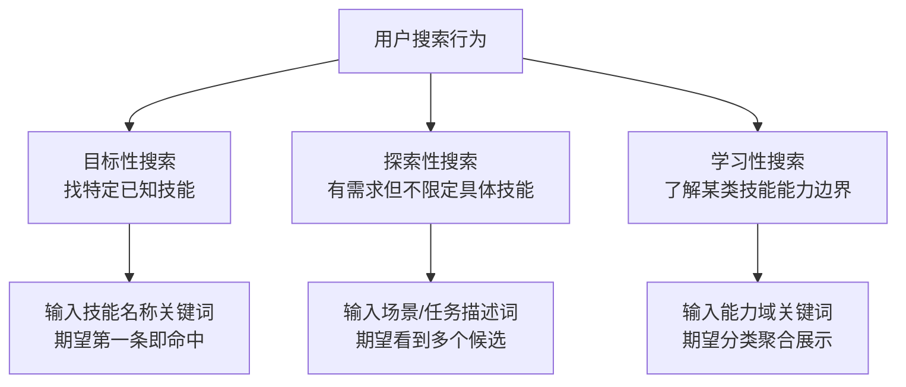
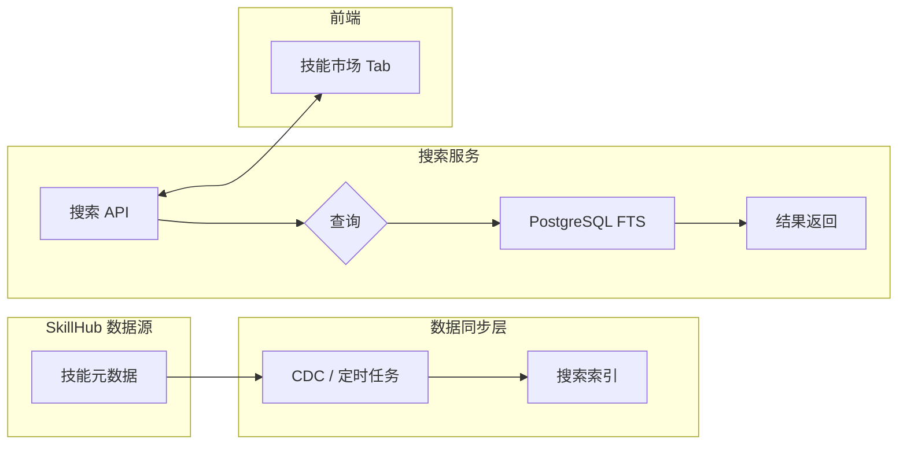
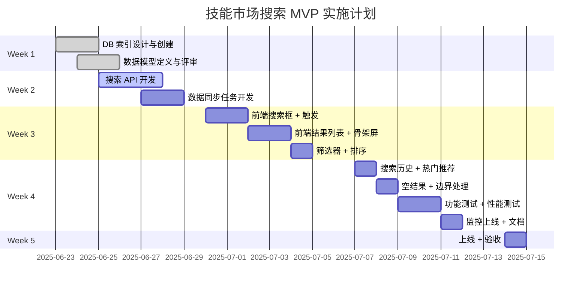

# 技能商城「技能市场 Tab」搜索能力产品设计及技术方案

> 文件路径：`F:\PKM\AI数字员工\10-Action\12-Active-活跃跟进\2615-技能商城搜索产品设计及技术方案.md`
> 版本：v1.0
> 日期：2026-06-23
> 状态：初稿

---

## 目录

- [1. 产品设计部分](#1-产品设计部分)
  - [1.1 搜索场景分析](#11-搜索场景分析)
  - [1.2 搜索交互设计](#12-搜索交互设计)
  - [1.3 搜索结果展示设计](#13-搜索结果展示设计)
  - [1.4 MVP 范围建议](#14-mvp-范围建议)
- [2. 技术方案部分](#2-技术方案部分)
  - [2.1 搜索技术选型](#21-搜索技术选型)
  - [2.2 数据流设计](#22-数据流设计)
  - [2.3 API 接口设计](#23-api-接口设计)
  - [2.4 性能与稳定性](#24-性能与稳定性)
  - [2.5 实现成本估算](#25-实现成本估算)
- [3. 实施路线图](#3-实施路线图)

---

## 1. 产品设计部分

## 1.1 搜索场景分析

### 1.1.1 用户角色

| 角色 | 描述 | 搜索诉求 |
|------|------|---------|
| 普通用户（企业员工） | 使用 AI 技能完成日常工作 | 快速找到能解决当前任务的技能，了解能力边界 |
| 管理员 / 运营 | 管理技能上架、分类、推荐 | 查找技能内容、监控搜索热词、调整排序 |
| 开发者 / Skill 作者 | 提交和维护技能 | 了解已有技能避免重复、查看技能被搜热度 |

### 1.1.2 搜索意图分类



| 意图类型 | 典型 Query 示例 | 期望结果量 | 排序诉求 |
|---------|----------------|-----------|---------|
| 目标性搜索 | "代码审查""周报生成" | 1-5条，精准优先 | 相关性排序 |
| 探索性搜索 | "客户跟进""会议纪要" | 5-20条，多样性 | 相关性 + 热度 |
| 学习性搜索 | "有哪些技能可以绘图""AI写作" | 10-30条，分类聚合 | 分类 + 热度 |

### 1.1.3 搜索入口位置

```
┌─────────────────────────────────────────┐
│  [技能市场]    [四港精选]    [发布 Skill] │
│─────────────────────────────────────────│
│                                         │
│  ┌─────────────────────────────────┐     │
│  │ 🔍 搜索技能名称、场景、标签...  │     │  ← Tab 内搜索框
│  └─────────────────────────────────┘     │
│                                         │
│  搜索历史: [周报生成] [代码审查] [✕]     │
│                                         │
│  热门推荐: 🌟 代码审查  🌟 周报生成       │
│           🌟 客户画像  🌟 会议纪要        │
│                                         │
└─────────────────────────────────────────┘
```

**结论**：搜索入口置于「技能市场」Tab 顶部，作为该 Tab 的核心功能入口。不设置全局搜索（当前阶段 Tab 数量少，全局搜索收益有限）。

---

## 1.2 搜索交互设计

### 1.2.1 搜索框设计

```json
{
  "placeholder": "搜索技能名称、场景或标签，如：代码审查、周报生成",
  "autocomplete_hints": [
    "根据用户输入实时展示推荐关键词",
    "最多展示 6 条，按相关性排序"
  ],
  "clear_button": "输入后右侧显示清除按钮",
  "voice_input": "V2 版本考虑语音输入"
}
```

### 1.2.2 搜索触发方式

| 方案 | 描述 | 优点 | 缺点 |
|------|------|------|------|
| **实时搜索（推荐）** | 输入后 300ms 无新字符则触发 | 用户体验流畅，即搜即得 | QPS 较高，需防抖 + 限流 |
| 回车触发 | 按下回车才执行搜索 | 控制 QPS，逻辑简单 | 多一步操作 |
| 按钮触发 | 点击搜索按钮执行 | 最可控 | 最差体验 |

**推荐方案**：实时搜索 + 300ms 防抖 + 优先展示输入框下方推荐/历史

### 1.2.3 搜索结果加载状态

```
┌──────────────────────────────────────┐
│  正在为您搜索"代码审查"...            │  ← 加载中状态
│  ████████░░░░░░░░░░░░░░░░░░░░░░░░░  │
└──────────────────────────────────────┘

┌──────────────────────────────────────┐
│  搜索结果（3条）                      │
│  ┌────────────────────────────────┐  │
│  │  [骨架屏卡片] 名称 简介 标签   │  │  ← 骨架屏
│  ├────────────────────────────────┤  │
│  │  [骨架屏卡片] 名称 简介 标签   │  │
│  ├────────────────────────────────┤  │
│  │  [骨架屏卡片] 名称 简介 标签   │  │
│  └────────────────────────────────┘  │
└──────────────────────────────────────┘
```

**骨架屏规范**：
- 每屏展示 6-9 条结果（移动端 6，PC 端 9）
- 骨架屏占位 3 行：技能名称行 + 简介 2 行
- 超过 300ms 才显示骨架屏（避免闪烁）
- 加载失败显示重试按钮

### 1.2.4 空结果处理

```
┌──────────────────────────────────────┐
│                                       │
│         🔍 （插画）                   │
│                                       │
│    未找到与"XXX"相关的技能            │
│                                       │
│    您可以：                           │
│    · 尝试其他关键词                   │
│    · 浏览全部技能 →                   │
│    · 发布新技能 →                     │
│                                       │
└──────────────────────────────────────┘
```

**策略**：
1. 空结果时展示热门技能作为兜底
2. 提供 "浏览全部" 入口，避免用户困在空结果
3. 记录空结果 Query，用于后续补充技能供给

### 1.2.5 搜索历史与热门推荐

**搜索历史**：
- 最多保存 10 条，支持左滑/点击删除单条
- 清空全部按钮（底部）
- 本地存储（localStorage），不与后端同步
- 超过 7 天自动过期

**热门推荐**：
- 从搜索系统拉取 Top N 关键词（服务端返回）
- 固定展示 4-8 个热搜词
- 点击热搜词直接发起搜索

---

## 1.3 搜索结果展示设计

### 1.3.1 卡片信息结构

```
┌─────────────────────────────────────────────────────┐
│  [技能图标/头像]                                     │
│                                                      │
│  代码审查助手                        ⭐ 4.8  🔥 1.2k │  ← 名称 + 评分 + 使用量
│                                                      │
│  自动进行 PR 代码审查，检测潜在 bug、              │
│  安全漏洞和代码规范问题，支持主流语言...            │  ← 简介（最多2行，超出省略）
│                                                      │
│  ┌────────┐ ┌────────┐ ┌────────┐                   │
│  │代码审查│ │AI辅助  │ │CI集成  │   +3             │  ← 标签（最多3个）
│  └────────┘ └────────┘ └────────┘                   │
│                                                      │
│  适用场景：研发团队 · 代码质量管理                   │  ← 适用场景
│                                                      │
│  提示词示例：                                        │
│  "请帮我审查这个 PR，重点关注性能问题"               │  ← 提示词示例（可折叠）
│                                                      │
│                              [立即使用] [收藏]       │
└─────────────────────────────────────────────────────┘
```

**字段说明**：

| 字段 | 必填 | 说明 | 最大长度 |
|------|------|------|---------|
| skill_name | 是 | 技能名称 | 50 字 |
| skill_icon | 否 | 技能图标 URL | - |
| rating | 否 | 评分 0-5 | 1 位小数 |
| usage_count | 否 | 使用次数 | - |
| description | 是 | 技能简介 | 200 字 |
| tags | 是 | 标签列表，最多 5 个 | 每标签 20 字 |
| scenarios | 否 | 适用场景描述 | 100 字 |
| prompt_example | 否 | 提示词示例 | 500 字 |
| author | 否 | 作者/来源 | 50 字 |
| created_at | 是 | 上架时间 | - |

### 1.3.2 筛选维度

```
┌─────────────────────────────────────────────────────────┐
│  筛选条件                                              │
│─────────────────────────────────────────────────────────│
│                                                         │
│  分类: [全部] [写作] [代码] [分析] [客服] [效率] [其他]  │
│                                                         │
│  场景: [全部] [办公] [研发] [营销] [管理] [通用]        │
│                                                         │
│  排序: [综合排序▼] [热度最高] [最新上架] [评分最高]     │
│                                                         │
└─────────────────────────────────────────────────────────┘
```

**筛选维度说明**：

| 维度 | 选项 | 数据来源 |
|------|------|---------|
| 分类 | 运营后台配置的技能分类 | skill.category |
| 场景 | 运营后台配置的场景标签 | skill.scenarios（数组） |
| 排序 | 综合/热度/最新/评分 | usage_count / created_at / rating |

**交互规范**：
- 筛选条件可叠加（分类 + 场景 + 排序）
- 筛选变更后保留搜索关键词
- 筛选器默认收起（移动端），PC 端可默认展开

### 1.3.3 排序方式

| 排序方式 | 字段 | 说明 |
|---------|------|------|
| 综合排序（默认） | 相关性 score | TF-IDF + field-length-norm 标准化 |
| 热度最高 | usage_count + 7 天增量 | 近期活跃度高优先 |
| 最新上架 | created_at DESC | 新技能优先 |
| 评分最高 | rating DESC | 质量优先 |

---

## 1.4 MVP 范围建议

### 第一版（MVP）- 预计 2-3 周

**必须具备**：
- [ ] Tab 内搜索框，placeholder 文案引导
- [ ] 关键词模糊搜索（名称 + 简介 + 标签）
- [ ] 搜索结果卡片展示（名称、简介、标签、评分）
- [ ] 空结果处理（展示兜底内容）
- [ ] 搜索历史（本地存储，最多 10 条）
- [ ] 热门推荐（服务端下发 Top 关键词）
- [ ] 筛选：分类筛选 + 排序切换
- [ ] 分页加载（无限滚动 or 页码切换）
- [ ] 骨架屏加载态

**不做的**：
- 搜索自动补全（autocomplete）
- 高级搜索语法（引号精确匹配、排除词）
- 搜索结果高亮
- 搜索权重配置后台

### 第二版迭代 - 预计 2-4 周

**功能清单**：
- [ ] 搜索自动补全（输入联想）
- [ ] 提示词示例折叠/展开
- [ ] 搜索结果关键词高亮
- [ ] 搜索分析后台（热词统计、无结果 Query）
- [ ] 个性化排序（基于用户历史使用技能）
- [ ] 语音搜索入口
- [ ] 搜索结果分享能力

---

## 2. 技术方案部分

## 2.1 搜索技术选型

### 2.1.1 方案对比

| 维度 | MySQL LIKE | PostgreSQL 全文搜索 | Elasticsearch | Milvus |
|------|------------|-------------------|--------------|--------|
| 实现复杂度 | 低 | 低 | 中 | 高 |
| 模糊匹配 | 差（前缀匹配） | 中（有限模糊） | 强（ngram 分词） | 仅向量检索 |
| 分词能力 | 无 | 基础（内置分词器） | 强（IK 等中文分词） | N/A |
| 相关性排序 | 无 | 基础 BM25 | 强（BM25 + 可调参数） | N/A |
| 扩展性 | 差（数据量>10万瓶颈） | 中（单机能撑百万） | 强（分布式） | 强 |
| 运维成本 | 低 | 低 | 高 | 高 |
| 中文支持 | 一般 | 一般 | 优秀 | 依赖 embedding 模型 |
| 推荐场景 | 技能<1万，简单场景 | 技能<10万，有分词需求 | 技能>10万，复杂检索 | 语义/相似度搜索 |

### 2.1.2 推荐方案

**MVP 推荐：PostgreSQL 全文搜索 + pg_trgm**

理由：
1. **零额外基础设施**：大多数项目已有 PostgreSQL，无需引入 Elasticsearch 等新组件
2. **中文分词支持**：配合 `zhparser` 或 `pg_jieba` 插件支持中文
3. **模糊匹配**：`pg_trgm` 扩展支持 trigram 模糊匹配，支持 `%关键词%` 级别模糊
4. **运维简单**：无需额外集群，学习成本低
5. **性能足够**：在百万级数据量下（技能远小于此），PostgreSQL 完全可胜任

**中长期（>10 万技能或需要语义搜索时）迁移 Elasticsearch**：
- 支持更复杂的相关性调参
- 支持向量检索（语义相似度搜索）
- Kibana 提供开箱即用的搜索分析

### 2.1.3 索引字段设计（PostgreSQL）

```sql
-- 启用扩展
CREATE EXTENSION IF NOT EXISTS pg_trgm;
CREATE EXTENSION IF NOT EXISTS zhparser;  -- 或 pg_jieba

-- 创建全文搜索配置（中文）
CREATE TEXT SEARCH CONFIGURATION zhcfg (parser = zhparser);
ALTER TEXT SEARCH CONFIGURATION zhcfg MAPPING FOR token WITH simple;

-- 技能表结构
CREATE TABLE skills (
    id              UUID PRIMARY KEY DEFAULT gen_random_uuid(),
    skill_name      VARCHAR(100) NOT NULL,
    name_tsv        TSVECTOR,                          -- 名称分词向量（GIN索引）
    description     TEXT,
    desc_tsv        TSVECTOR,                          -- 简介分词向量（GIN索引）
    tags            TEXT[] DEFAULT '{}',
    tag_tsv         TSVECTOR,                          -- 标签分词向量（GIN索引）
    scenarios       TEXT[] DEFAULT '{}',
    author          VARCHAR(100),
    category        VARCHAR(50),
    rating          DECIMAL(3,2) DEFAULT 0,
    usage_count     INTEGER DEFAULT 0,
    created_at      TIMESTAMPTZ DEFAULT NOW(),
    updated_at      TIMESTAMPTZ DEFAULT NOW(),
    is_published    BOOLEAN DEFAULT false,

    -- 复合索引：名称 trigram 模糊搜索
    name_trgm       TEXT GENERATED ALWAYS AS (skill_name) STORED
);

-- GIN 索引：全文搜索
CREATE INDEX idx_skills_name_tsv  ON skills USING GIN (name_tsv);
CREATE INDEX idx_skills_desc_tsv  ON skills USING GIN (desc_tsv);
CREATE INDEX idx_skills_tag_tsv   ON skills USING GIN (tag_tsv);

-- btree_gin 索引：分类/标签数组筛选
CREATE INDEX idx_skills_category ON skills USING GIN (category);
CREATE INDEX idx_skills_tags     ON skills USING GIN (tags);

-- GiST 索引：trigram 模糊搜索（支持 ILIKE '%关键词%' 高效执行）
CREATE INDEX idx_skills_name_trgm ON skills USING GIN (name_trgm gin_trgm_ops);

-- 组合索引：筛选+排序
CREATE INDEX idx_skills_published_rating ON skills (is_published, rating DESC) WHERE is_published = true;
CREATE INDEX idx_skills_published_usage   ON skills (is_published, usage_count DESC) WHERE is_published = true;
CREATE INDEX idx_skills_published_created ON skills (is_published, created_at DESC) WHERE is_published = true;
```

**搜索向量更新触发器**：

```sql
CREATE OR REPLACE FUNCTION skills_update_tsv() RETURNS TRIGGER AS $$
BEGIN
    NEW.name_tsv  := setweight(to_tsvector('zhcfg', COALESCE(NEW.skill_name, '')), 'A') ||
                     setweight(to_tsvector('zhcfg', COALESCE(array_to_string(NEW.tags, ' '), '')), 'B') ||
                     setweight(to_tsvector('zhcfg', COALESCE(NEW.description, '')), 'C');
    NEW.tag_tsv   := to_tsvector('zhcfg', COALESCE(array_to_string(NEW.tags, ' '), ''));
    NEW.updated_at := NOW();
    RETURN NEW;
END;
$$ LANGUAGE plpgsql;

CREATE TRIGGER skills_tsv_update
    BEFORE INSERT OR UPDATE ON skills
    FOR EACH ROW EXECUTE FUNCTION skills_update_tsv();
```

---

## 2.2 数据流设计

### 2.2.1 整体数据流架构



### 2.2.2 数据同步策略

**方案 A：定时全量同步（适合 MVP）**

```
┌──────────────┐     每日凌晨 2:00      ┌─────────────────┐
│  SkillHub    │ ─────────────────────→  │  搜索索引表     │
│  (源数据库)   │     SELECT + UPSERT    │  (PostgreSQL)   │
└──────────────┘                         └─────────────────┘
```

**方案 B：CDC 增量同步（适合 V2）**

```
┌──────────────┐     Debezium CDC      ┌─────────────────┐
│  SkillHub    │ ─────────────────────→  │  搜索索引表     │
│  (源数据库)   │    实时增量事件        │  (PostgreSQL)   │
└──────────────┘                         └─────────────────┘
```

| 策略 | 延迟 | 实现复杂度 | 适用场景 |
|------|------|----------|---------|
| 定时全量 | 小时级 | 低 | MVP，数据量 < 10 万 |
| CDC 增量 | 分钟级 | 中 | V2，数据量大或实时性要求高 |

**MVP 选择：定时全量同步**
- 凌晨 2:00 执行，从 SkillHub 全量拉取
- 使用 `ON CONFLICT (id) DO UPDATE` 实现 upsert
- 记录同步时间戳，用于监控

```sql
-- 同步 SQL（伪代码，应用层实现）
INSERT INTO skills (id, skill_name, description, tags, ...)
VALUES
    (:id, :name, :desc, :tags, ...),
    ...
ON CONFLICT (id) DO UPDATE SET
    skill_name   = EXCLUDED.skill_name,
    description  = EXCLUDED.description,
    tags         = EXCLUDED.tags,
    updated_at   = NOW()
WHERE
    skills.updated_at < EXCLUDED.updated_at  -- 增量条件
;
```

### 2.2.3 同步任务实现

```python
# sync_skills_to_search.py（伪代码）
import asyncio
from datetime import datetime

async def sync_skills():
    last_sync_time = await get_last_sync_time()  # 从 KV 存储获取

    # 1. 增量拉取 SkillHub 变更
    changed_skills = await skillhub.fetch_changed_since(last_sync_time)

    # 2. 批量 upsert 到搜索表
    if changed_skills:
        await db.execute_batch("""
            INSERT INTO skills (...) VALUES (...)
            ON CONFLICT (id) DO UPDATE SET ...
        """, changed_skills)

    # 3. 软删除下架技能（SkillHub 有 deleted_at 标记）
    removed_skills = await skillhub.fetch_deleted_since(last_sync_time)
    if removed_skills:
        await db.execute("""
            UPDATE skills SET is_published = false WHERE id = ANY(:ids)
        """, removed_skills)

    # 4. 更新同步时间戳
    await set_last_sync_time(datetime.now())

    logger.info(f"Synced {len(changed_skills)} skills, removed {len(removed_skills)}")

# 定时执行：每日凌晨 + 可手动触发
schedule.every().day.at("02:00").do(sync_skills)
```

---

## 2.3 API 接口设计

### 2.3.1 搜索接口

**POST /api/v1/skills/search**

**请求参数**：

```json
{
  "keyword": "代码审查",
  "page": 1,
  "page_size": 10,
  "category": "code",
  "sort_by": "relevance",
  "user_id": "u_123"
}
```

| 参数 | 类型 | 必填 | 默认值 | 说明 |
|------|------|------|--------|------|
| keyword | string | 是 | - | 搜索关键词，1-100 字 |
| page | int | 否 | 1 | 页码，从 1 开始 |
| page_size | int | 否 | 10 | 每页条数，最大 50 |
| category | string | 否 | null | 技能分类筛选 |
| sort_by | string | 否 | "relevance" | 排序：relevance/hot/new/rating |
| user_id | string | 否 | null | 用户 ID（用于记录搜索历史） |

**响应结构**：

```json
{
  "code": 0,
  "message": "success",
  "data": {
    "total": 128,
    "page": 1,
    "page_size": 10,
    "total_pages": 13,
    "items": [
      {
        "id": "skill_001",
        "skill_name": "代码审查助手",
        "description": "自动进行 PR 代码审查，检测潜在 bug、安全漏洞...",
        "tags": ["代码审查", "AI辅助", "CI集成"],
        "scenarios": ["研发团队", "代码质量管理"],
        "rating": 4.8,
        "usage_count": 1247,
        "author": "四港 AI Lab",
        "created_at": "2025-03-15T10:00:00Z",
        "prompt_example": "请帮我审查这个 PR，重点关注性能问题",
        "match_highlight": {
          "skill_name": "代码审查助手",
          "description": "自动进行 PR <em>代码</em><em>审查</em>..."
        }
      }
    ]
  },
  "trace_id": "tr_abc123"
}
```

**错误码**：

| code | message | 说明 |
|------|---------|------|
| 0 | success | 成功 |
| 40001 | INVALID_KEYWORD | 关键词格式错误 |
| 40002 | INVALID_PAGINATION | 分页参数错误 |
| 50001 | SEARCH_SERVICE_ERROR | 搜索服务异常 |
| 50002 | SEARCH_TIMEOUT | 搜索超时 |

### 2.3.2 热门搜索词接口

**GET /api/v1/skills/search/hot-words**

**响应**：

```json
{
  "code": 0,
  "message": "success",
  "data": {
    "words": [
      { "keyword": "代码审查", "search_count": 5420 },
      { "keyword": "周报生成", "search_count": 4890 },
      { "keyword": "会议纪要", "search_count": 3200 },
      { "keyword": "客户画像", "search_count": 2100 }
    ],
    "updated_at": "2025-06-23T00:00:00Z"
  }
}
```

### 2.3.3 搜索建议接口（V2）

**GET /api/v1/skills/search/suggest**

**请求**：`?keyword=代码&limit=6`

**响应**：

```json
{
  "code": 0,
  "data": {
    "suggestions": [
      { "keyword": "代码审查", "type": "skill" },
      { "keyword": "代码生成", "type": "skill" },
      { "keyword": "代码优化", "type": "intent" }
    ]
  }
}
```

---

## 2.4 性能与稳定性

### 2.4.1 分页策略

| 方案 | 原理 | 优点 | 缺点 |
|------|------|------|------|
| 偏移分页 (OFFSET) | `LIMIT N OFFSET M` | 实现简单，支持跳页 | 深度页性能差 |
| 游标分页 (Keyset) | `WHERE id < :cursor ORDER BY id DESC LIMIT N` | 性能稳定，不随页深退化 | 不能跳页 |
| 搜索后uid分页 | `WHERE (score, id) < (:last_score, :last_id)` | 支持排序下的游标分页 | 实现稍复杂 |

**推荐**：MVP 使用 **偏移分页**，V2 升级为 **搜索后 uid 分页**。

**分页限制**：
- `page_size` 最大值：50
- 最大翻页深度：第 100 页（即最多返回 5000 条结果）

### 2.4.2 QPS 预估与限流

| 场景 | DAU | 搜索转化率 | 日搜索次数 | 峰值 QPS（×1.5） |
|------|-----|-----------|----------|----------------|
| 初期 | 100 | 30% | 30 | < 1 |
| 成长期 | 1000 | 30% | 300 | ~5 |
| 成熟期 | 10000 | 30% | 3000 | ~50 |

**限流策略**：

```yaml
# API 限流配置
rate_limit:
  default: 100 QPS / IP
  search:  20 QPS / IP / user_id  # 同一用户搜索限速
  hot_words: 10 QPS / IP           # 热门词接口更严格

# 搜索服务限流（令牌桶）
search_service:
  max_concurrent: 50
  timeout_ms: 2000
  circuit_breaker:
    error_threshold: 50%
    sleep_window_s: 10
```

### 2.4.3 缓存策略

| 缓存内容 | 缓存 Key | TTL | 说明 |
|---------|---------|-----|------|
| 热门搜索词 | `hot_words:v1` | 1 小时 | 下游可用 CDN/Redis |
| 用户搜索历史 | `search_history:{user_id}` | 7 天 | 本地 localStorage（前端） |
| 搜索结果 | `search:{md5(keyword+page+sort)}` | 5 分钟 | 不推荐，因人而异 |
| 分类/筛选枚举 | `categories:v1` | 24 小时 | 配置类数据 |

---

## 2.5 实现成本估算

### 2.5.1 开发工作量（人天）

| 模块 | 任务 | 工期 | 负责人 |
|------|------|------|--------|
| **后端搜索服务** | | | |
| | PostgreSQL 索引设计与创建 | 0.5 天 | DBA |
| | 搜索 API 开发（search + hot-words） | 2 天 | 后端 |
| | 数据同步任务开发 | 1.5 天 | 后端 |
| | 限流与稳定性配置 | 0.5 天 | 后端 |
| **前端** | | | |
| | 搜索框组件（输入、防抖、清除） | 1 天 | 前端 |
| | 搜索结果列表 + 骨架屏 | 1.5 天 | 前端 |
| | 筛选器组件 | 1 天 | 前端 |
| | 空结果 / 热门推荐 UI | 0.5 天 | 前端 |
| | 搜索历史（localStorage） | 0.5 天 | 前端 |
| **测试 & 运维** | | | |
| | 搜索功能测试 | 1 天 | QA |
| | 性能测试（压测） | 0.5 天 | QA |
| | 监控告警配置 | 0.5 天 | DevOps |
| | 上线文档 | 0.5 天 | 后端 |
| **合计** | | **11.5 天** | **约 2-3 周（2人）** |

### 2.5.2 基础设施依赖

| 依赖 | 用途 | 现有/新增 |
|------|------|---------|
| PostgreSQL | 搜索索引存储 | 复用项目现有 DB |
| 应用服务器 | 搜索 API 服务 | 复用现有服务 |
| Redis（可选） | 缓存热门词 | 如已有则复用 |
| 定时任务调度 | 数据同步 | 复用项目 Cron |
| 日志/监控 | 搜索质量监控 | 复用现有 APM |

**新增基础设施成本**：零（PostgreSQL 已有情况下）。

---

## 3. 实施路线图



---

## 附录：关键实现文件路径（项目落地时参考）

```
backend/services/search_service.py  — 搜索业务逻辑核心
backend/models/skill.py             — 技能数据模型与索引字段定义
frontend/components/SkillSearch/    — 前端搜索组件目录
scripts/sync_skills_to_search.py   — 数据同步定时任务脚本
api/v1/skills.py                   — 搜索 API 路由定义
```

---

> 文档版本历史
> - v1.0 (2026-06-23)：初稿，完成搜索产品设计 + 技术方案